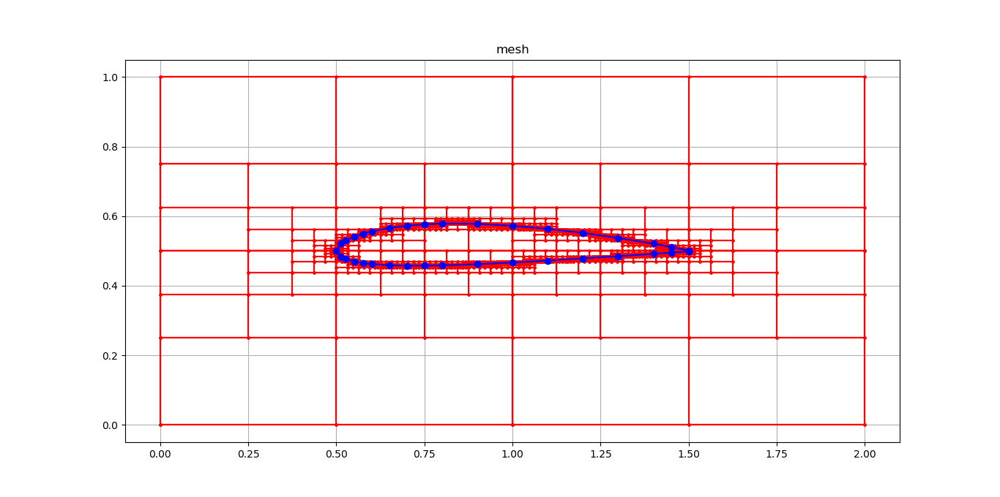
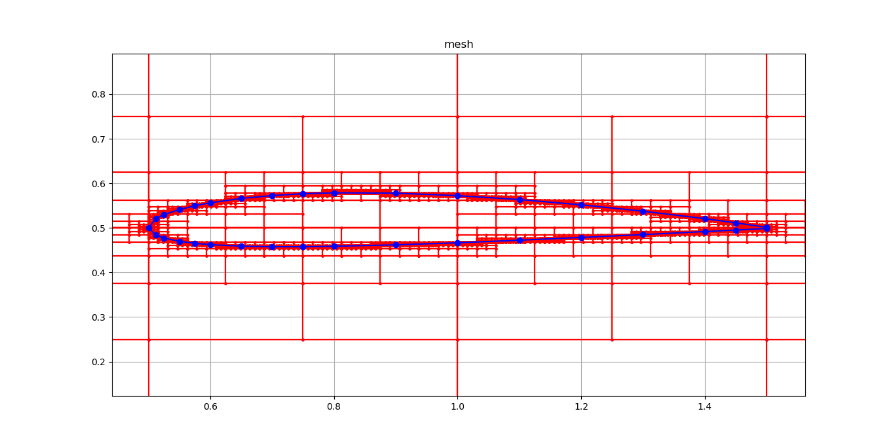
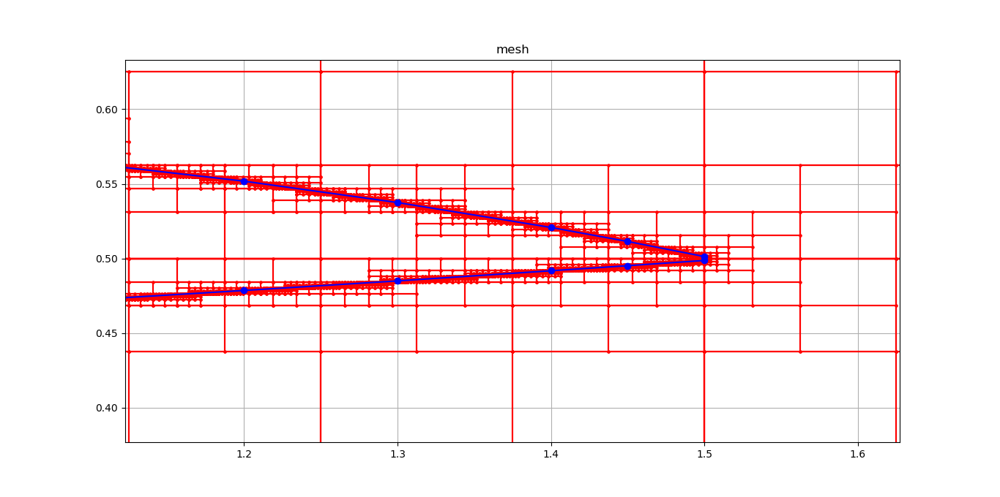

# SAMARITAN
*A block structured mesh generator based on quad tree decomposition*
### Author : Sayan Bhattacharjee
### Email : aero.sayan@gmail.com
LICENSE : DEFAULT : for now; will update to GPL v2 very soon.

### INTRODUCTION
This is a block stuctured grid generator based on quad tree decomposition for Computaional Fluid Dynamics. The quad tree decompositon is done after running a series of ray-box intersection tests. The ray is created from the geometric edges and the box are the internal domains of the mesh.

### FOLDER STRUCTURE :
SAMARITAN
+ |=> src : contains the source files
+ ==|=> mods : contains the C++ backend
+ |=> geoms : contains the mesh geometry
+ |=> mesh-pictures : conatains mesh output pictures

### TECHNOLOGY USED
+ C++ for high performance code
+ Cython for linking C++ code with Python
+ Python for calling the C++ code
+ Python for visualization

### COMPILATION AND TEST
#### For developers :
To compile only the C++ code and do development.
First cd to src folder, then run scons, then run main.exe, then run visualizeMesh.py.
```
$ cd src
$ scons
$ main.exe
$ python visualizeMesh.py
```
#### For use in python :
I have use Cython to allow Python to call the grid generator from Python itself. For this we used setuptools of Python 2.7 to create a .pyd file that can be imported into Python as a library.
It is to be noted that we are using Microsoft Visual Studio Compiler to compiler our library for compatibility.

```
$ cd src
$ python setup.py build_ext --inplace -cmsvc
$ ls | grep samaritan.pyd
samaritan.pyd*
$ python testSamaritan.py
$ python visualizeMesh.py
```

### Meshing result for a NACA-2412 aerofoil
Fig 1 : NACA 2412 mesh


Fig 2 : NACA 2412 mesh zoomed


Fig 3 : NACA 2412 trailing edge mesh zoomed


For more pictures see mesh-pictures folder.
